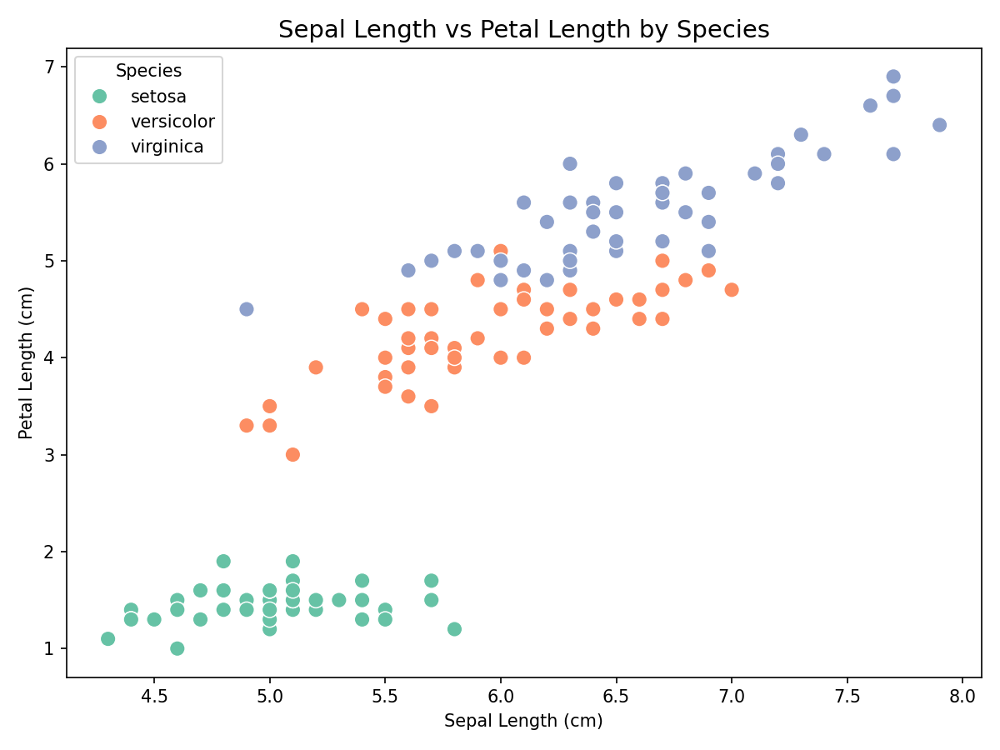
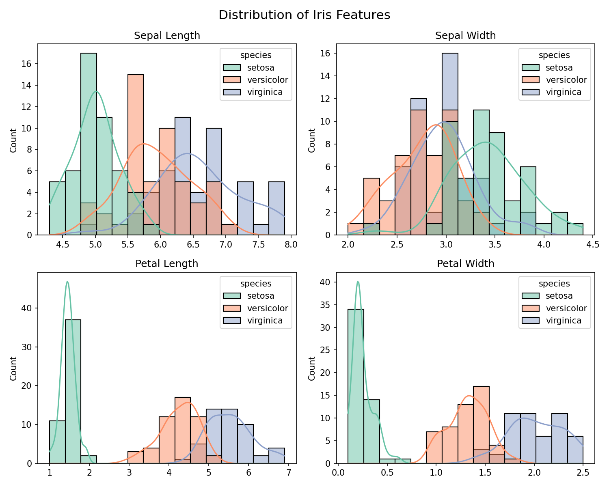
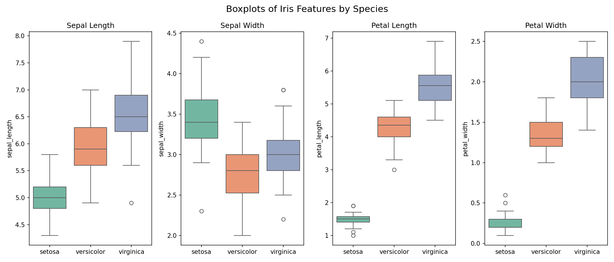
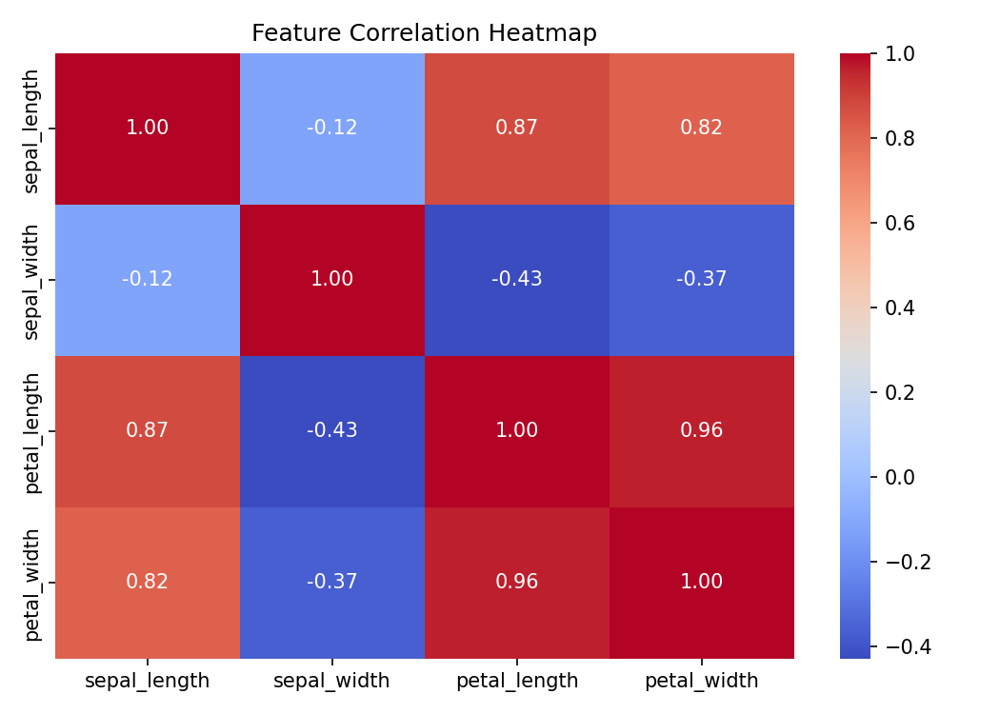

# Iris Dataset - Exploratory Data Analysis

This was one of my first structured data projects. The goal was not to solve a business problem but to get comfortable with the full EDA workflow, loading data, summarizing it, visualizing distributions, spotting patterns, and understanding what the numbers actually mean. The Iris dataset is a standard starting point for this and it is clean enough to focus on the process rather than the cleaning.

---

## The Dataset

150 flower samples across three species: Setosa, Versicolor, and Virginica. Four measurements per sample: sepal length, sepal width, petal length, and petal width, all in centimeters. No missing values. 50 samples per species, perfectly balanced.

**Source:** Built into seaborn, originally from UCI Machine Learning Repository.

---

## What I Did

**1. Inspected the structure**
Checked shape, data types, summary statistics, missing values, and class distribution using pandas. The dataset was clean with no nulls and no duplicates.

**2. Scatter plot**
Plotted sepal length against petal length, colored by species. The separation between Setosa and the other two species is immediate and obvious. Setosa sits completely apart in the bottom left. Versicolor and Virginica overlap slightly but are mostly distinguishable.

**3. Histograms**
Plotted the distribution of all four features broken down by species. Petal length and petal width show the clearest separation between species. Sepal width is the messiest, with all three species overlapping heavily.

**4. Box plots**
Side by side box plots for each feature. Setosa has the tightest spread across all four measurements, meaning it is the most consistent species in this dataset. Virginica has the largest petals on average. Sepal width had a few outliers in Setosa, visible as dots above the whiskers.

**5. Correlation heatmap**
Petal length and petal width are almost perfectly correlated at 0.96. Sepal length also correlates strongly with both petal measurements at 0.87 and 0.82. Sepal width is the odd one out, showing weak or negative correlations with everything else.

---

## What I Took Away

Setosa is so distinct from the other two species that it could be identified from petal measurements alone. Versicolor and Virginica are harder to separate and would need a model to draw a reliable boundary between them.

Sepal width is the least useful feature for distinguishing species. If I were building a classifier on this data, I would lead with petal length and petal width as the primary features.

This project gave me a solid foundation in using pandas for data inspection and matplotlib and seaborn for visualization, which I applied directly in every project that followed.

---

## Tech Stack

Python, pandas, matplotlib, seaborn

---

## Author

**Aiman Ishaq**
CS Student | Data Analyst Intern, Developers Hub Corporation
[LinkedIn](https://linkedin.com/in/aiman-ishaq) . [GitHub](https://github.com/aiman-ami)
